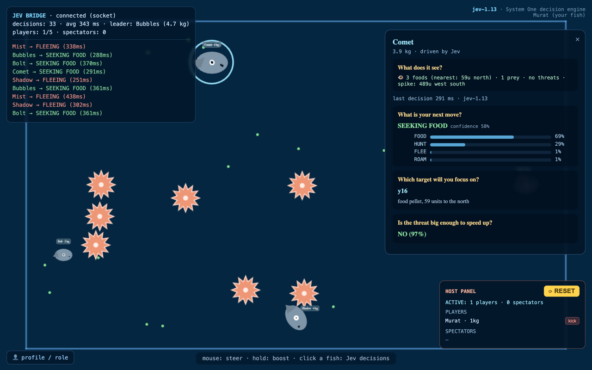

# 🐟 JEV — The Fish Game

**A real-time multiplayer fish game where the AI literally decides through a language model.** Every fish on the map asks **[Jev](https://typesafe.ai)** — a *System One* decision model — what to do next: flee, hunt, seek food, or roam. You steer your own fish with the mouse and try to outsmart them.



## Why is this interesting?

Most "AI games" call an LLM and parse free text. This one treats AI as a **programming primitive**: Jev never generates text — it returns typed decisions with calibrated probabilities, and plain `if/else` code consumes them:

```json
{
  "action":  { "choice": "flee", "confidence": 0.83 },
  "target":  { "choice": "Bubbles", "detail": "threat 170 units to the east" },
  "panic":   { "noul": 0.88 }
}
```

Three questions per fish, answered in **~300 ms** for fractions of a cent — batched in a single request, gated in code. Click any fish to read its live **Q&A panel**: what it sees, what it was asked, and what it answered — with confidence bars.

## Features

- 🧠 **Jev-driven AI** — every decision is a TypeSafe System One call: `choice` (action + target), `noul` (panic 0-1). Full Q&A inspector per fish.
- 🌐 **Authoritative multiplayer** — 30 Hz server simulation, 10 Hz WebSocket broadcast, dead-reckoning client interpolation at 60 fps. One shared world for up to 5 players + unlimited spectators.
- 🎨 **Expressive faces** — fish open their mouths in fear, drool when hungry, narrow their eyes while hunting.
- 🍽️ **Metabolism** — energy and mass decay over time; hunger drives the AI's
  choices (and starved fish die and scatter as pellets). Big fish must keep
  hunting: pellets alone can't sustain them.
- 🌟 **Spikes** — agar.io-style mines: touch one and you explode into pellets for everyone else. Jev sees them and steers around them.
- 📈 **Mass-scaled speed** — small fish are nimble, big fish are tanks.
- 👤 **Instant role switching** — change your nickname or jump between player and spectator at any moment.
- 🔄 **Live deploys** — clients detect a server update, wipe local state and reload themselves.
- 🛡️ **Safe architecture** — the API key lives only in `.env` on the server. If Jev is unreachable, a local fallback brain keeps the game playable.

## Quick start

```bash
git clone https://github.com/muratcanberber/JEV-TheFishGame.git
cd JEV-TheFishGame
npm install

cp .env.example .env        # then paste your key from console.typesafe.ai
npm start                   # → http://localhost:8787
```

> No key? The game still runs — all AI fish fall back to a local rule-based brain, and the HUD marks their decisions as "local".

**Controls:** mouse steers · hold to boost · click a fish to read its Jev Q&A · bottom-left button to change your nickname or role.

## How it works

```
[Authoritative Node server]
  ├─ 30 Hz simulation (physics, eating, walls, spikes)
  ├─ Jev decision loop: each AI fish every ~4-8 s, ≤3 concurrent calls
  ├─ WebSocket /ws → 10 Hz world frames + decision events
  └─ localhost-only host API (/manage, /reset)

[Browser client]
  ├─ Three.js r160, orthographic 2D scene
  ├─ Dead-reckoning interpolation: 10 Hz data → 60 fps smooth motion
  ├─ Human-readable Q&A inspector (no raw JSON)
  └─ Auto-self-update on server deploys
```

**The Jev question set** (one batched request per fish):

| Question | Type | Returns |
|---|---|---|
| "What should this fish do next?" | `choice` | flee / hunt / eat_food / roam + probabilities + confidence |
| "Which object should this move focus on?" | `choice` | a nearby food/prey/threat id |
| "Is this fish threatened enough to speed up?" | `noul` | 0-1 probability (drives sprint) |

Thresholds, wall & spike avoidance, and all game policy live in **code** — the model supplies the judgment. That separation is the whole point: the same weights serve every account, but every world behaves exactly as its host codes it.

## Performance

5 AI fish ≈ **70 decisions/min** (TypeSafe limit: 1,200/min) ≈ **$0.10/hour**. World frame ≈ 1.5 KB × 10 Hz — dozens of spectators are trivial.

## Share it

The tunnel one-liner puts the game online in seconds:

```bash
npm start &
cloudflared tunnel --url http://localhost:8787
```

If you build something fun on top of this, open a PR — the Q&A inspector makes it easy to *see* what the model is doing.

## License

MIT — see [LICENSE](LICENSE).
